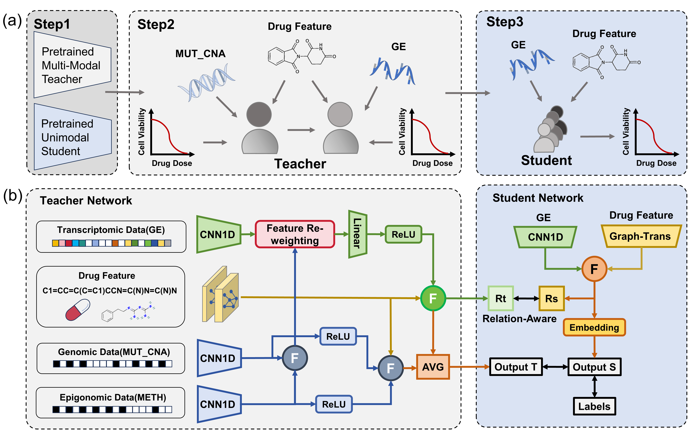

# KDRUG

Here we introduce **A Multi-Modal Genomic Knowledge Distillation Framework for Drug Response Prediction**. Specifically, we train a teacher network by feature re-weighting based on inter-modality dependencies and align the inter-sample correlations through our proposed relation-aware differentiation distillation.

**Note:** The sections on Datasets, Model, and Training below describe the contents of the respective directories. Due to size constraints and permissions, some data and ckpts may not be uploaded. The download url can be found in our paper.

## Datasets
Download GDSC origion dataset from https://pan.baidu.com/share/init?surl=Z7xiX4TQyaXKydSceNhp0g (code:KDRU)

    `global_data/`                  - path of origional GDSC/TCGA files  
    `data/processed/xxxxGDSCxx.pt`  - path of processed bulk data, train, val and test

## Model
### training model:
1|models/gat_gcn_transformer_meth_ge_mut.py;
  models/gat_gcn_transformer_meth_ge.py
2|models/gat_gcn_transformer_meth_ge_mut.py -> models/gat_gcn_transformer_ge_only.py
3|models/gat_gcn_transformer_meth_ge_mut_multiple.py
4|models/gat_gcn_transformer_meth_ge_mut_multiheadattn.py
5|models/gat_gcn_transformer_meth_ge_mut_multiple.py -> models/gat_gcn_transformer_ge_only.py
6|models/gat_gcn_transformer_meth_ge_mut_multiheadattn.py -> models/gat_gcn_transformer_ge_only.py
7|models/gat_gcn_transformer_meth_ge_mut_multiheadattn.py -> models/gat_gcn_transformer_ge_only.py
8|models/gat_gcn_transformer_meth_ge_mut_multiheadattn.py -> models/gat_gcn_transformer_ge_only.py

## Training
### training code:
1|origion multi-modal/single-modal module: training.py  
2|distill from origion multi-modal: training_continue_KD1.py       
3|our proposed privileged information knowledge distillation framework: training_continue_combine.py
4|feature re-weighting strategy using in 3: training_continue_combine.py
5|distill from module 3: training_continue_KD.py
6|distill from module 4: training_continue_KD.py
7|distill from module 4; KD LOSS + RAD loss: training_continue_KD.py
8|distill from module 4; only RAD loss: training_continue_KD.py

### loss:
1| MSE
2| MSE + KD
3| MSE
4| MSE
5| MSE + KD
6| MSE + KD
7| MSE + KD + RAD
8| MSE + RAD

|origion ge-modal weights used in code|:
result/2024-05-14 18:37:42/model_GAT_GCN_Transformer_ge_only_GDSC.model

|origion multi-modal weights used in code|:
model_GAT_GCN_Transformer_meth_ge_mut_GDSC.model

|origion combined model|:
model_continue_combine_pretrain_relu_GDSC.model

|our multi-modal & re-weighted strategy|:
model_continue_combine_pretrain_multiheadattn(ge_others)_relu_GDSC.model

### TCGA test
result/plot_TCGA/compute_GDSC_TCGA_distribution.py

* Thanks to [Thang Chu, et al.] for providing excellent code and documentation. This project was inspired by and includes some code from [GraTransDRP] T. Chu, T. T. Nguyen, B. D. Hai, Q. H. Nguyen and T. Nguyen, "Graph Transformer for Drug Response Prediction," in IEEE/ACM Transactions on Computational Biology and Bioinformatics, vol. 20, no. 2, pp. 1065-1072, 1 March-April 2023
